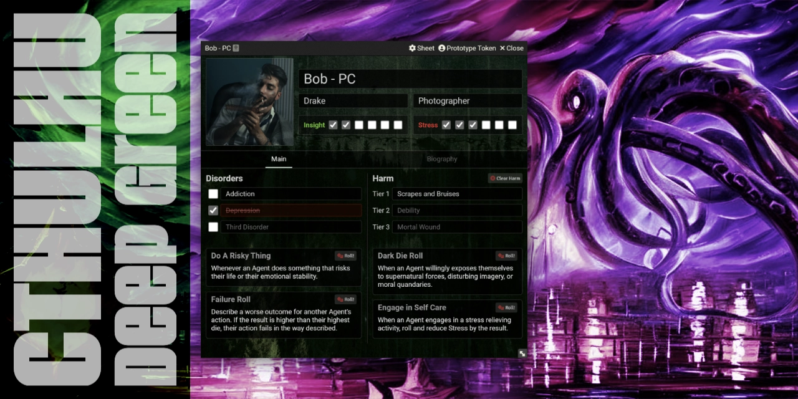
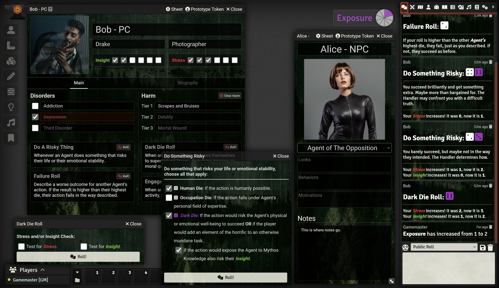

# Cthulhu Deep Green (Unofficial) System

<!--  -->

An unofficial, community-supported system for playing the Cthulhu Deep Green TTRPG (Created by Justin Ford) on Foundry VTT.

- The original rules from the author of Cthulhu Deep Green: https://www.mothlands.com/games/cdg

Image of the Character Sheet and roll messages in Foundry's chat:

## Features

- Simple Character Sheet
  - Name, Image, Alias, Occupation, Insight & Stress trackers
  - Buttons to roll Do a Risky Thing, Dark Die Roll, Failure Roll, Engage in Self Care Roll
  - Disorders section
  - Harm section
  - A place to track Anchors
  - A Notes section
- Clicking on the roll buttons on the character sheet creates dialogs (When appropriate) to choose which die to roll
- The Dark Die roll automatically increases your Insight & or Stress when appropriate
- All rolls print appropriate outputs into the chat
- Tokens can be setup to show Insight & Stress state

## To Be Done

- Fix NPCs
- Designs and CSS improvements
- Add System Settings
  - Add in rules from CD Variants

## How to Install

You can install the latest released version of the system by using this manifest link in Foundry VTT.

[Instructions](https://foundryvtt.com/article/tutorial/): https://github.com/philote/FoundryVTT-CthulhuDeepGreen/releases/latest/download/system.json

This software includes ideas and text from ["Cthulhu Deep Green"](https://www.mothlands.com/games/cdg) by [Justin Ford](https://www.mothlands.com/about) which is licensed under [CC BY-SA 4.0](https://creativecommons.org/licenses/by-sa/4.0/).
