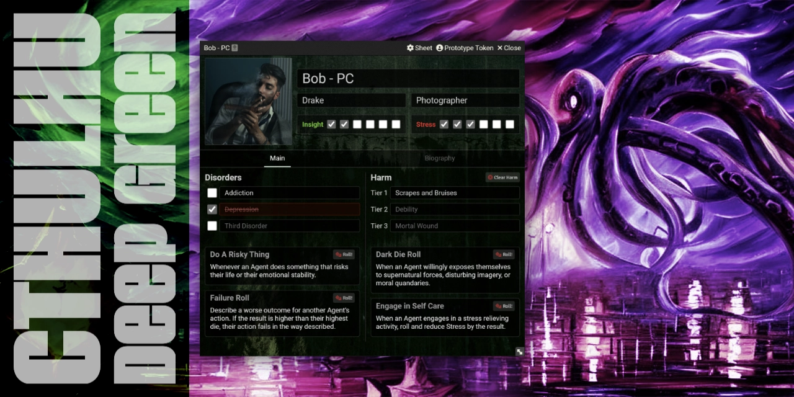
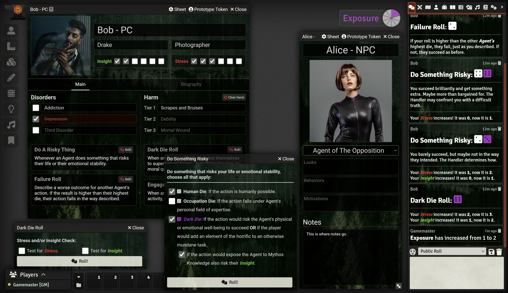

# Cthulhu Deep Green (Unofficial) System

An unofficial, community-supported system for playing the Cthulhu Deep Green TTRPG (Created by Justin Ford) on Foundry VTT.

	
	
    
     
     
    
    

     
     
     
    

   	

The original rules from the author of Cthulhu Deep Green: https://www.mothlands.com/games/cdg

If you’ve enjoyed my work and find value in what I create, please consider supporting me with a small donation on [Ko-fi](https://ko-fi.com/G2G3I91JQ). I truly love what I do, and your support helps me dedicate time and resources to ongoing development. Every contribution, no matter the size, makes a difference and allows me to continue doing what I’m passionate about. Thank you for considering—it means the world to me.

Image of the Character Sheet and roll messages in Foundry's chat:

## Features

- Simple Character Sheet
  - Name, Image, Alias, Occupation, Insight & Stress trackers
  - Buttons to roll Do a Risky Thing, Dark Die Roll, Failure Roll, Engage in Self Care Roll
  - Disorders section
  - Harm section
  - A place to track Anchors
  - A Notes section
- Settings
  - Show/Hide the "Special Skill" on character sheets
  - Show/Hide the Exposure tracker
- An Exposure Track that only the GM can update with right and left clicks
- Clicking on the roll buttons on the character sheet creates dialogs (When appropriate) to choose which die to roll
- The Dark Die roll automatically increases your Insight & or Stress when appropriate
- All rolls print appropriate outputs into the chat
- Tokens can be setup to show Insight & Stress states
- A simple NPC Sheet

## To Be Done

- Add roll tables to the module
- UI for non-die roll "at home" actions

## How to Install

You can install the latest released version of the system by using this manifest link in Foundry VTT.

[Instructions](https://foundryvtt.com/article/tutorial/): https://github.com/philote/FoundryVTT-CthulhuDeepGreen/releases/latest/download/system.json

This software includes ideas and text from ["Cthulhu Deep Green"](https://www.mothlands.com/games/cdg) by [Justin Ford](https://www.mothlands.com/about) which is licensed under [CC BY-SA 4.0](https://creativecommons.org/licenses/by-sa/4.0/).
